# gonenshop

React Express Mongodb Nodejs are used in this project.

Page is here: [https://gonenshop.herokuapp.com](https://gonenshop.herokuapp.com/)

## Screenshots

### Homepage

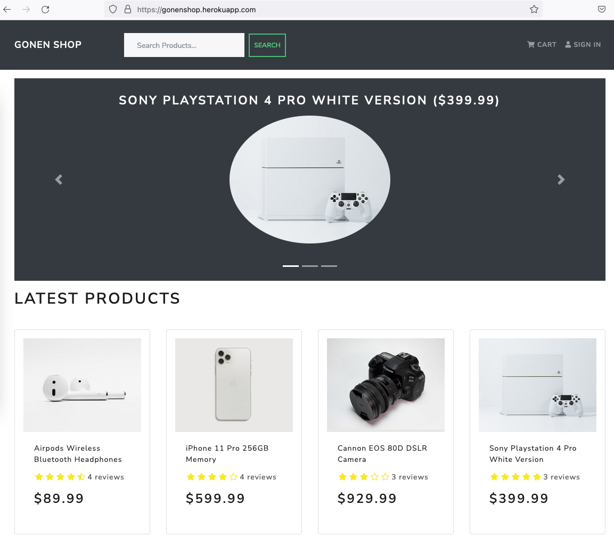

### Product Page

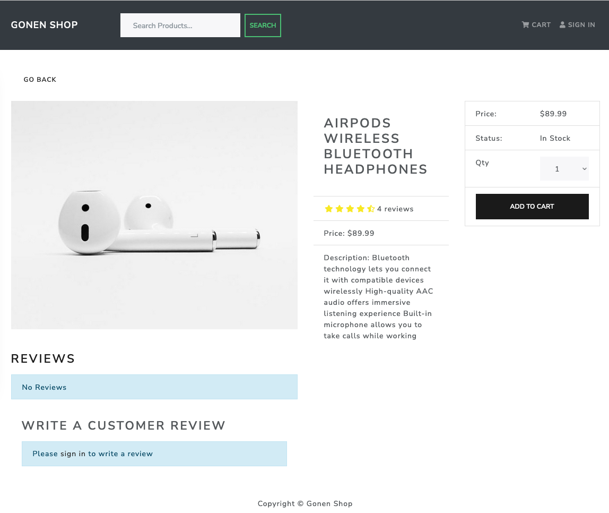

### User Profile Menu

### Shopping Cart

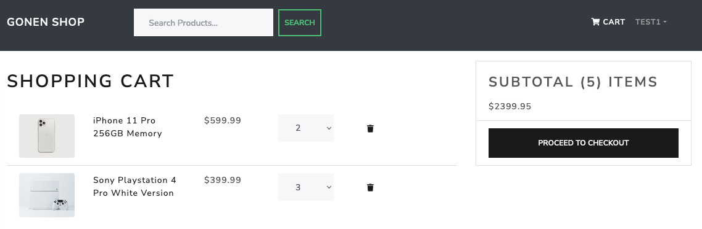

### Shippin Form

### Select Payment Method

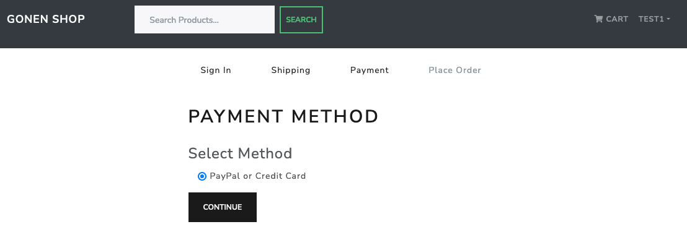

### Order Summary and Place Order Page

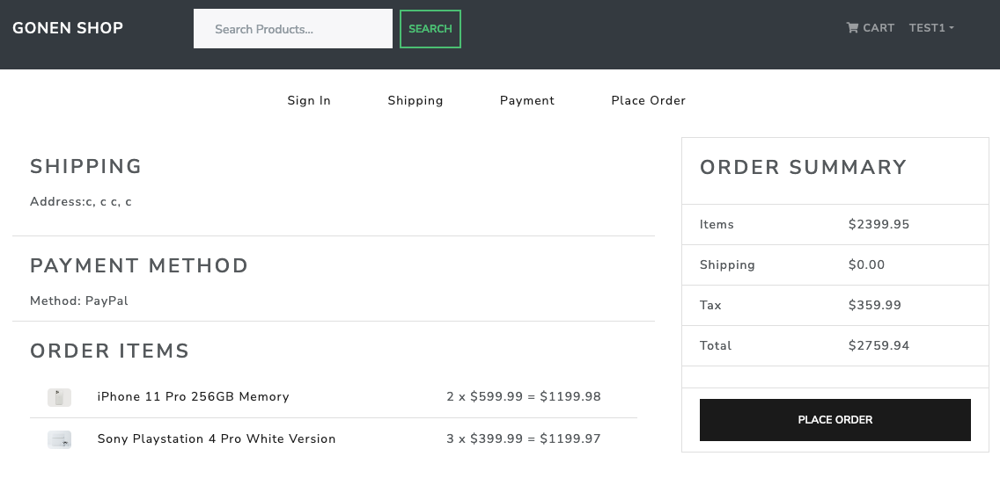

### Paypal Login Window

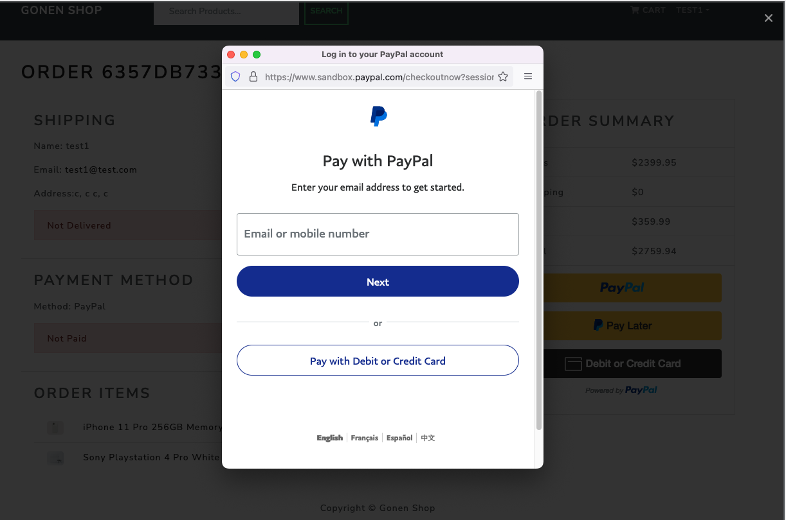

### Paypal Payment Options

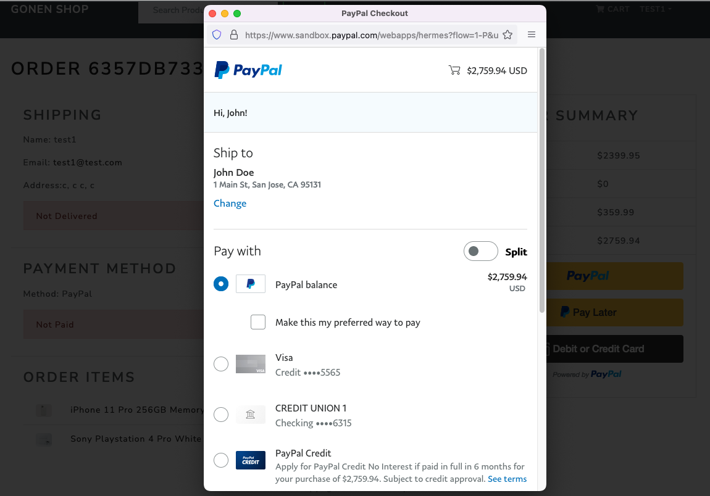

### My Order

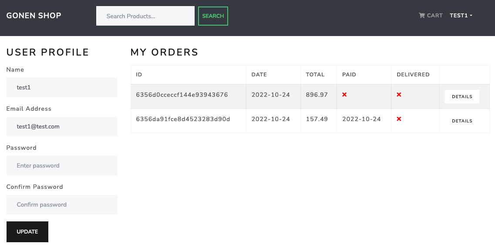

### Admin Profile Menu

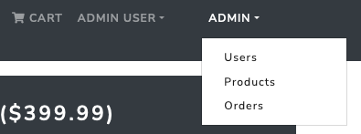

### Admin Panel Products

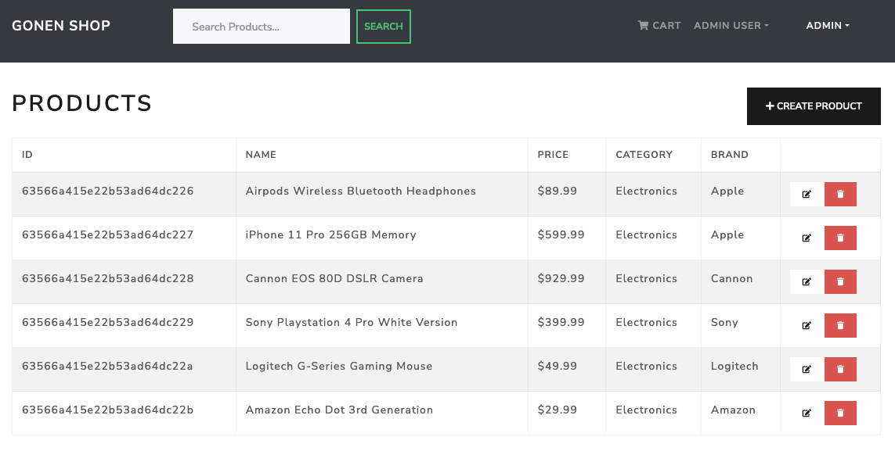

### Admin Panel Edit Products

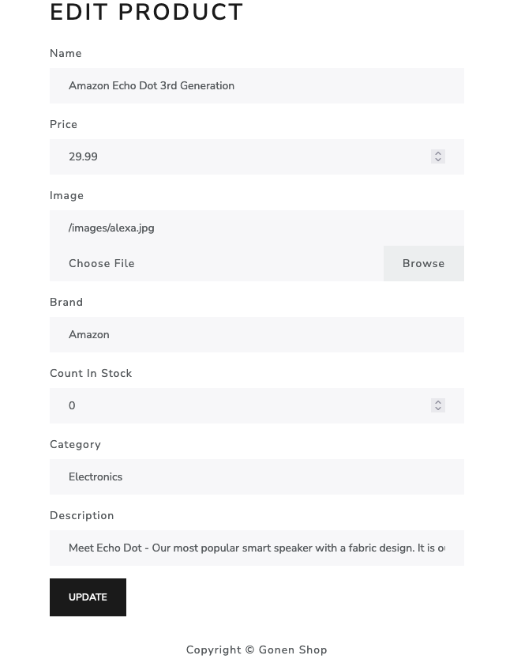

### Admin Panel Users List

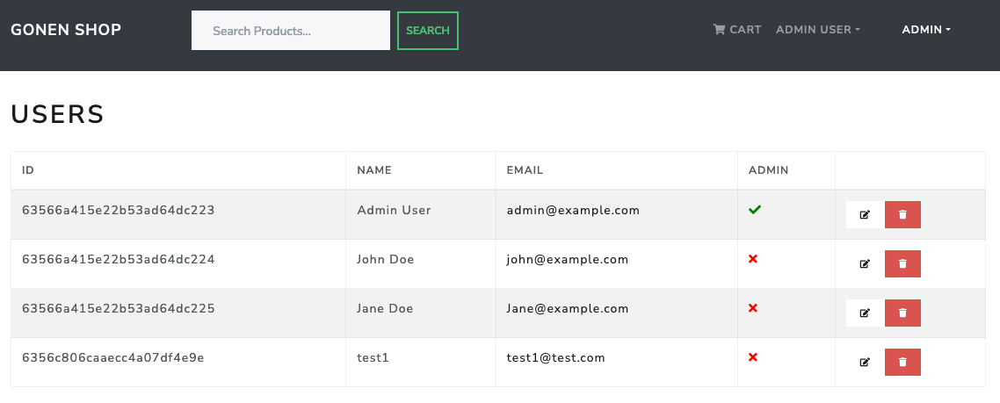

### User's Order Details

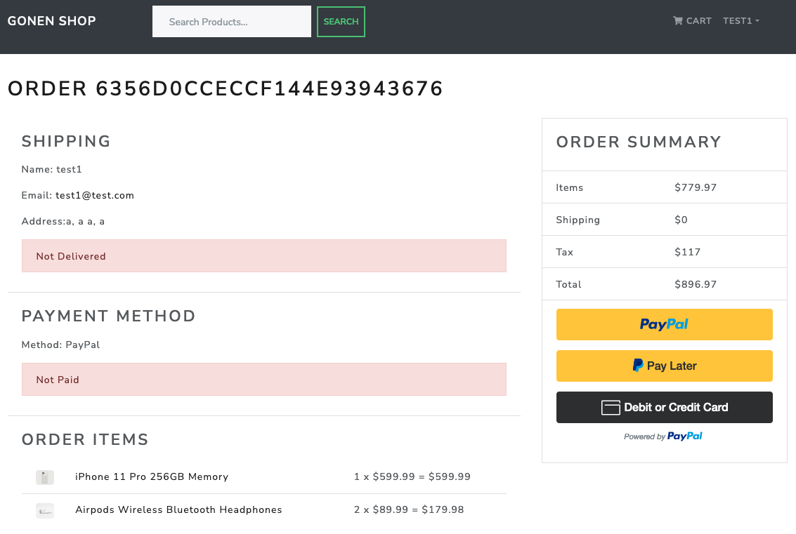

### Sign In Page

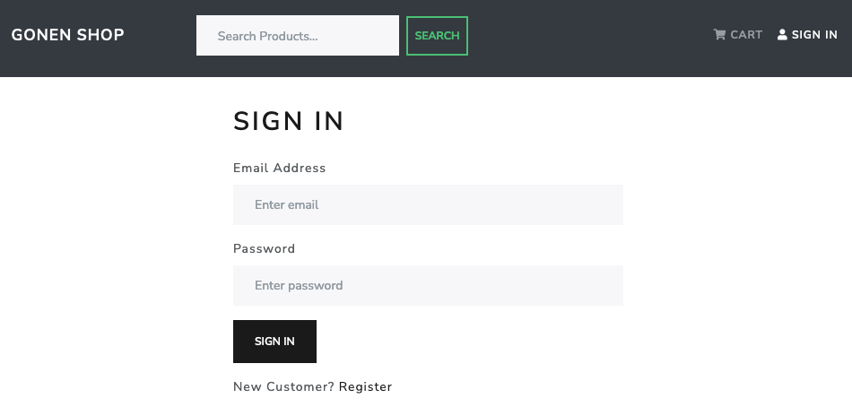

### Signup Page

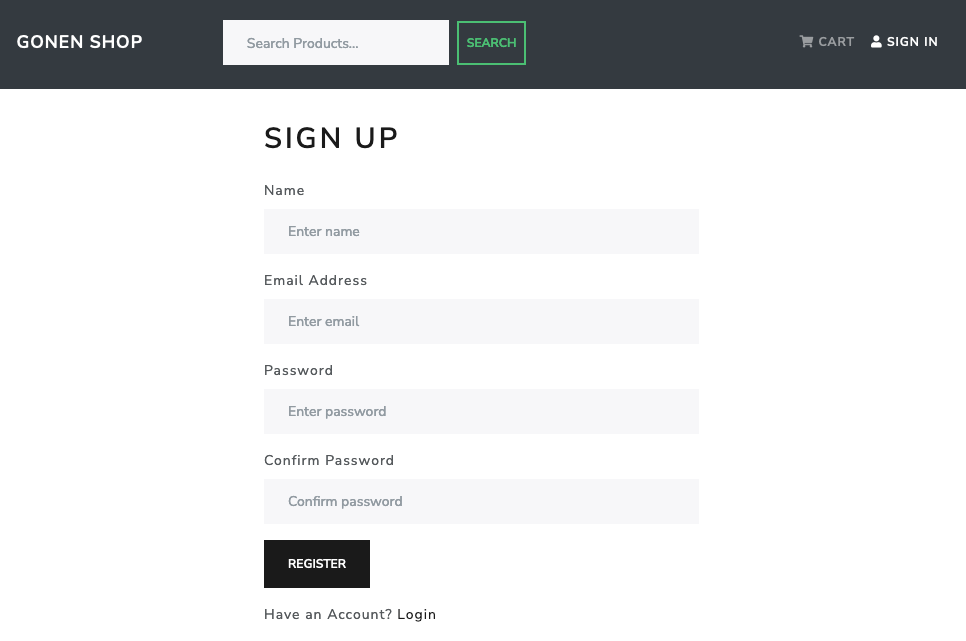
