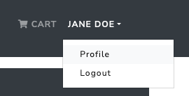
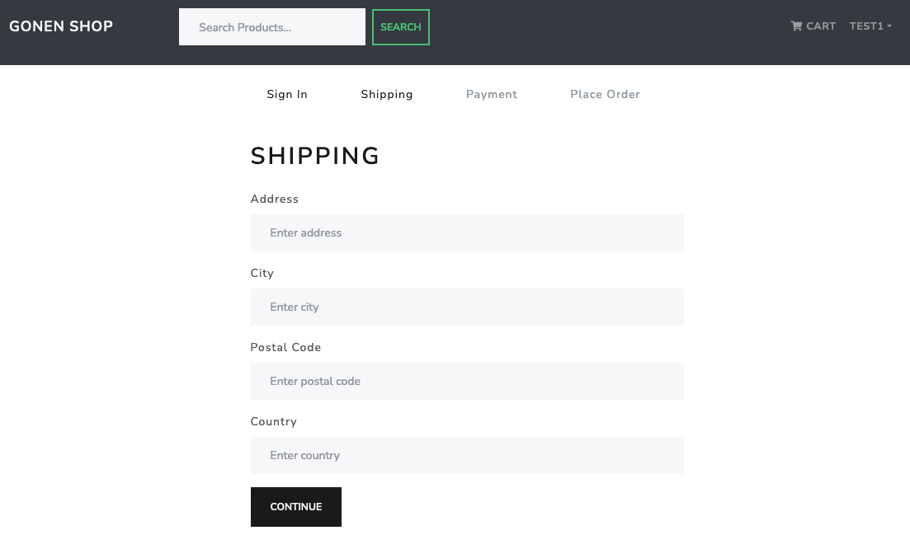

# gonenshop

React Express Mongodb Nodejs are used in this project.

Page is here: [https://gonenshop.herokuapp.com](https://gonenshop.herokuapp.com/)

## Screenshots

### Homepage

### Product Page

### User Profile Menu

### Shopping Cart

### Shippin Form

### Select Payment Method

### Order Summary and Place Order Page

### Paypal Login Window

### Paypal Payment Options

### My Order

### Admin Profile Menu

### Admin Panel Products

### Admin Panel Edit Products

### Admin Panel Users List

### User's Order Details

### Sign In Page

### Signup Page

